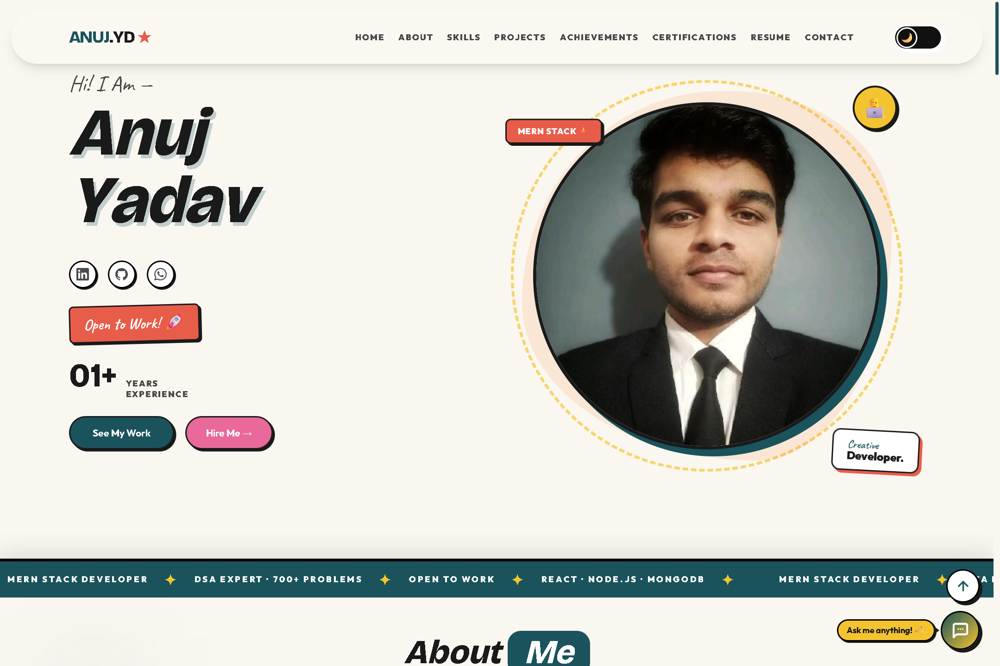

# Anuj Yadav • Portfolio

A modern, animated, and responsive developer portfolio built with React + Vite. It showcases projects, skills, certifications, DSA stats, and a Gemini-powered chatbot that answers based on portfolio data.

## What’s Inside

- Hero, About, Skills, Projects, DSA, Achievements, Certifications, Resume, Contact
- Floating chatbot with Gemini API (serverless)
- Theme toggle (light/dark)
- Rich motion and interactive UI

## Live Demo

Deployed URL: `https://anuj-yd.vercel.app`

## Screenshots

### Home



The hero section introduces the portfolio with a bold headline, animated accents, and quick visual context about the developer. It’s designed to feel energetic and immediately communicate the tech-forward style of the site.

## Tech Stack

- React 19, Vite
- Tailwind CSS v4, Styled Components
- Framer Motion, GSAP, Anime.js, Lottie
- Recharts, react-scroll, react-icons
- Formspree for contact form

## Quick Start

```bash
git clone https://github.com/anuj-yd/portfolio.git
cd portfolio
npm install
npm run dev
```

## Environment Variables

Create a `.env` file in the project root:

```env
# Formspree
VITE_FORMSPREE_ENDPOINT=
VITE_FORMSPREE_FORM_ID=

# Gemini (serverless)
GEMINI_API_KEY=
GEMINI_MODEL=gemini-1.5-flash
```

## Gemini Chatbot (Vercel Serverless)

This project uses a Vercel serverless function for Gemini:

- `api/chat.js` handles the request
- Portfolio data is injected server-side
- Frontend calls `/api/chat`

When deploying on Vercel, add `GEMINI_API_KEY` in Project Settings ? Environment Variables and redeploy.

## Formspree Setup

1. Create a form in Formspree and copy the endpoint URL.
2. Add the endpoint to your hosting provider environment:
   - `VITE_FORMSPREE_ENDPOINT`
3. Redeploy after adding the environment variable.

## Project Structure

```text
src/
+-- components/
¦   +-- chatbot/
¦   +-- layout/
¦   +-- sections/
¦   +-- ui/
+-- data/
+-- hooks/
+-- App.jsx
+-- main.jsx
api/
+-- chat.js
public/
```

## Customization

Update content in:

- `src/data/profile.js`
- `src/data/projects.json`
- `src/data/skills.json`
- `src/data/achievements.json`
- `src/data/dsa-stats.json`

## Scripts

```bash
npm run dev
npm run build
npm run preview
npm run lint
```

## Author

Anuj Yadav
- GitHub: https://github.com/anuj-yd
- LinkedIn: https://linkedin.com/in/anuj-yd

## License

MIT

